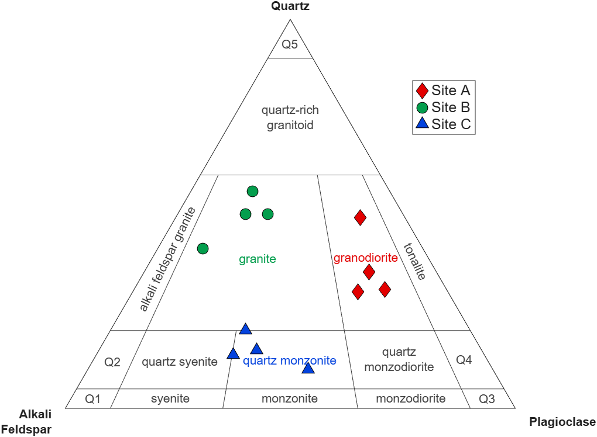
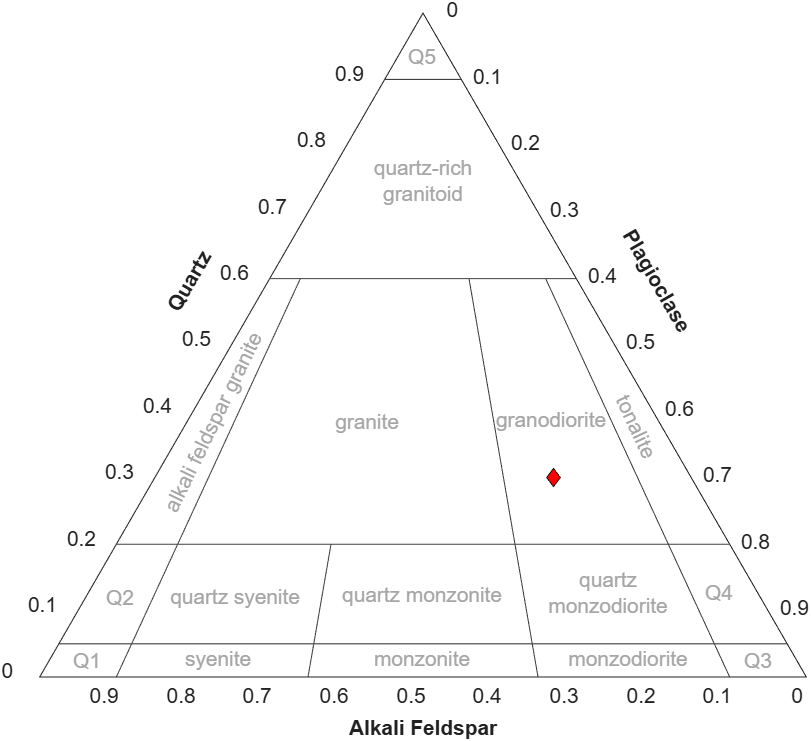
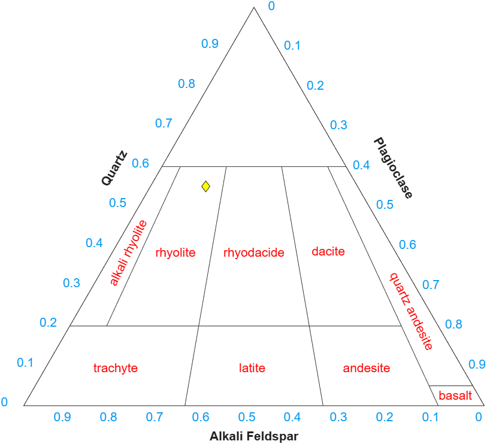

# **QAP Diagrams**
[](LICENSE)
[](https://www.mathworks.com/products/matlab.html)
[](https://github.com/weber1158/qap-diagrams/blob/main/scripts/STEM_Showcase.mlx)

[](https://www.mathworks.com/matlabcentral/fileexchange/184858-qap-diagrams) 
[](https://matlab.mathworks.com/open/fileexchange/v1?id=184858)

Create Q-A-P ternary diagrams in MATLAB.



# 🪨 MATLAB STEM Showcase 2026
The latest release of this repository contains a [MATLAB Live Script file](https://github.com/weber1158/qap-diagrams/blob/main/scripts/STEM_Showcase.mlx) as my submission to the 2026 MATLAB [STEM Showcase](https://www.mathworks.com/matlabcentral/contests/2026-matlab-stem-showcase.html). The Live Script is designed as an interactive tool that teaches and helps explain how geologists use ternary diagrams to identify igneous rocks. 

If the paths aren't working properly when using the Live Script, try re-setting the current folder to the main directory for the `QAP Diagrams` repository (e.g., `C:\<path-to-folder>\QAP Diagrams\`) and then execute

```
>> edit STEM_Showcase
```
from the Command Window. This should open the Live Script and give it access to the necessary asset files. 

## 💡 About
#### What is a Q-A-P diagram?
A Q-A-P diagram is a ternary phase diagram where the three corners of the triangle correspond to 100% quartz (Q), 100% alkali feldspar (A), and 100% plagioclase feldspar (P), respectively. The interior of the Q-A-P diagram is divided into sections belonging to different igneous rock types, such as granites. Q-A-P diagrams are useful in geologic studies that concern these common mineral phases.

## ⬇️ Installation
#### Main Repository
Download the `QAP Diagrams` repository on GitHub or the File Exchange and call the `pathool` function from the MATLAB Command Window to permanently add the functions to the search path.

#### Dependencies
You will also need to download and install the following:

* `alchemyst/ternplot` v1.1.0 by Carl Sandrock [[link to download](https://www.mathworks.com/matlabcentral/fileexchange/2299-alchemyst-ternplot)].

# 📖 Documentation
## `qap_diagram`

<details>
<summary> <b>Description</b> </summary>

Constructs a prelabeled Q-A-P diagram. To be used in tandem with the `ternplot` function. 

Please note, however, that the syntax for plotting ternary coordinates on the Q-A-P diagram is `ternplot(A,P,Q)`.
</details>

<details>
<summary> <b>Syntax</b> </summary>

`qap_objects = qap_diagram(varargin)`
</details>

<details>
<summary> <b>Name-Value Arguments</b> </summary>

All name-value arguments are optional.

| Name      | Class | Value (Default)      |
| ------------- | --- | ------------- |
| `IgneousClass` | char | `'Plutonic'` (other option: `'Volcanic'`) |
| `FontColor` | RGB Triplet or Hexadecimal | `[0.65 0.65 0.65]` |
| `GridLines` | char | `'off'` |
| `LineStyle` | cell vector | `{'-','LineWidth',0.5,'Color',[0.25 0.25 0.25]}` |
| `VertexLabels` | char | `'off'` |
</details>

<details>
<summary> <b>Outputs</b> </summary>

Passing an output argument is optional. 

Passing an output argument will save the Q-A-P chart objects to a convenient MATLAB `struct` array so that the user can modify chart objects after compilation. For example:

* The user can change the font weight of the "quartz" label by doing this:

```
H = qap_diagram();
H.AxesLabels.Quartz.FontWeight = 'bold';
```

* To change multiple objects at once, wrap the objects in square brackets and distribute the operation using the `deal` function like this:

```
H = qap_diagram();
[H.TickLabels.Color] = deal('r');
```
</details>

<details>
<summary> <b>Example 1</b> </summary>

Construct a Q-A-P diagram and then overlay a `ternplot` object showing a sample that is 52% plagioclase, 30% quartz, and 18% alkali feldspar:

```
A = 18;
P = 52;
Q = 30;
figure(1)
qap_diagram();
ternplot(A,P,Q,'kd','MarkerFaceColor','r')
```




**NOTE:** For this to work properly, you must pass `A` first, then `P`, then `Q` when calling the `ternplot(A,P,Q)` function!

</details>

<details>
<summary> <b>Example 2</b> </summary>

Construct a Q-A-P diagram for a volcanic sample with red rock labels. Save the chart objects to a variable called H and then modify the color of the tick labels using a custom color.

```
A = 33;
P = 12;
Q = 55;
figure(2)
H = qap_diagram('IgneousClass','Volcanic','FontColor','r');
ternplot(A,P,Q,'kd','MarkerFaceColor','y');
[H.TickLabels.Color] = deal([0.02 0.60 0.95]);
```



**NOTE:** For this to work properly, you must pass `A` first, then `P`, then `Q` when calling the `ternplot(A,P,Q)` function!

</details>

## 🎓 How to cite

Please cite both of the following when using `QAP Diagrams` in your reserach publications:

```
Sandrock, Carl (2015). alchemyst/ternplot v1.1.0. GitHub. https://github.com/alchemyst/ternplot (Last accessed: YYYY-MM-DD)
```

```
Weber, Austin M. (2026). QAP Diagrams v1.1.0. GitHub. https://github.com/weber1158/qap-diagrams (Last accessed: YYYY-MM-DD)
```
